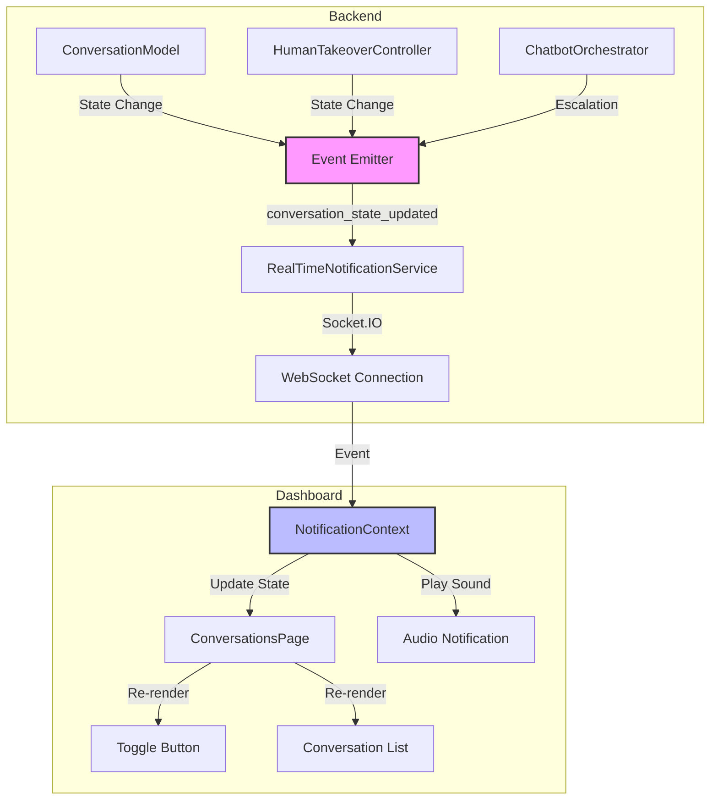

# Design Document: Real-Time Conversation Updates

## Overview

This feature implements real-time conversation state synchronization between the backend and dashboard using WebSocket events. Currently, when conversation states change (escalation, human takeover start/end), the dashboard requires manual page refresh to reflect these changes. This design leverages the existing Socket.IO infrastructure (RealTimeNotificationService) to emit state update events and extends the dashboard's NotificationContext to handle these events, ensuring the UI always reflects the current conversation state within 1 second.

The solution focuses on minimal changes to existing code, adding event emission at key state transition points in the backend and event handling in the dashboard's existing WebSocket connection.

## Architecture

### High-Level Architecture



### Component Interaction Flow

1. **State Change Trigger**: Backend methods (escalateConversation, setHumanTakeover) are called
2. **Event Emission**: RealTimeNotificationService emits 'conversation_state_updated' event
3. **Event Reception**: Dashboard NotificationContext receives event via Socket.IO
4. **State Update**: NotificationContext updates conversations state and triggers re-render
5. **UI Update**: ConversationsPage reflects new state in toggle button and conversation list
6. **Audio Notification**: If escalation, play notification sound

### Data Flow

```
Backend State Change → WebSocket Event → Dashboard State Update → UI Re-render
```

## Components and Interfaces

### Backend Components

#### 1. RealTimeNotificationService Extension

**Purpose**: Add method to emit conversation state update events

**New Method**:
```typescript
static async sendConversationStateUpdate(
  conversationId: string,
  status: ConversationStatus,
  humanTakeoverActive: boolean,
  agentId?: string
): Promise<void>
```

**Event Payload Structure**:
```typescript
interface ConversationStateUpdateEvent {
  conversationId: string;
  status: 'active' | 'escalated' | 'resolved';
  humanTakeoverActive: boolean;
  timestamp: string; // ISO 8601
  agentId?: string;
}
```

#### 2. ConversationModel Integration Points

**Methods to Instrument**:
- `escalateConversation()` - Emit event after status update
- `setHumanTakeover()` - Emit event after takeover state change
- `updateStatus()` - Emit event after status change (if called directly)

**Integration Pattern**:
```typescript
// After state update
await RealTimeNotificationService.sendConversationStateUpdate(
  conversationId,
  newStatus,
  humanTakeoverActive,
  agentId
);
```

#### 3. HumanTakeoverController Integration Points

**Methods to Instrument**:
- `startTakeover()` - Emit event after successful takeover start
- `endTakeover()` - Emit event after successful takeover end
- `transferControl()` - Emit event after successful transfer

### Dashboard Components

#### 1. NotificationContext Extension

**Purpose**: Handle conversation state update events and manage conversation state

**New State**:
```typescript
interface NotificationState {
  notifications: Notification[];
  conversations: Map<string, ConversationStateCache>; // NEW
}

interface ConversationStateCache {
  status: ConversationStatus;
  humanTakeoverActive: boolean;
  agentId?: string;
  lastUpdate: Date;
}
```

**New Event Handler**:
```typescript
socket.on('conversation_state_updated', (data: ConversationStateUpdateEvent) => {
  // Update conversation cache
  // Trigger audio notification if escalation
  // Dispatch state update action
});
```

**New Context Methods**:
```typescript
getConversationState(conversationId: string): ConversationStateCache | undefined;
subscribeToConversationUpdates(callback: (conversationId: string) => void): () => void;
```

#### 2. ConversationsPage Integration

**State Management Changes**:
- Subscribe to conversation updates via NotificationContext
- Update local conversation state when events received
- Update aiEnabled map when events received
- Maintain existing polling as fallback

**Update Logic**:
```typescript
useEffect(() => {
  const unsubscribe = notificationContext.subscribeToConversationUpdates((conversationId) => {
    const updatedState = notificationContext.getConversationState(conversationId);
    
    // Update conversations array
    setConversations(prev => prev.map(conv => 
      conv.id === conversationId 
        ? { ...conv, ...updatedState }
        : conv
    ));
    
    // Update selected conversation if applicable
    if (selectedConversation?.id === conversationId) {
      setSelectedConversation(prev => ({ ...prev, ...updatedState }));
    }
    
    // Update aiEnabled map
    setAiEnabled(prev => ({
      ...prev,
      [conversationId]: !updatedState.humanTakeoverActive
    }));
  });
  
  return unsubscribe;
}, []);
```

#### 3. Audio Notification Component

**Purpose**: Play notification sound when conversations are escalated

**Implementation**:
```typescript
const useEscalationAudio = () => {
  const audioRef = useRef<HTMLAudioElement | null>(null);
  
  useEffect(() => {
    audioRef.current = new Audio('/notification.mp3');
    audioRef.current.volume = 0.5;
  }, []);
  
  const playNotification = useCallback(() => {
    audioRef.current?.play().catch(err => {
      console.log('Audio playback blocked:', err);
    });
  }, []);
  
  return playNotification;
};
```

## Data Models

### Event Payload Model

```typescript
interface ConversationStateUpdateEvent {
  conversationId: string;
  status: 'active' | 'escalated' | 'resolved';
  humanTakeoverActive: boolean;
  timestamp: string; // ISO 8601 format
  agentId?: string; // Present when humanTakeoverActive is true
}
```

**Validation Rules**:
- conversationId: Non-empty string, must match UUID format
- status: Must be one of 'active', 'escalated', 'resolved'
- humanTakeoverActive: Boolean
- timestamp: Valid ISO 8601 string
- agentId: Optional, non-empty string when present

### Conversation State Cache Model

```typescript
interface ConversationStateCache {
  status: ConversationStatus;
  humanTakeoverActive: boolean;
  agentId?: string;
  lastUpdate: Date;
}
```

**Purpose**: Store conversation state in NotificationContext for quick access without API calls

**Lifecycle**: 
- Created when first event received
- Updated on each subsequent event
- Cleared on logout or connection loss

## Correctness Properties

*A property is a characteristic or behavior that should hold true across all valid executions of a system—essentially, a formal statement about what the system should do. Properties serve as the bridge between human-readable specifications and machine-verifiable correctness guarantees.*


### Property 1: Event Emission on State Changes

*For any* conversation state change operation (escalation, human takeover start/end, status update), the system SHALL emit a 'conversation_state_updated' event with the correct conversation ID and new state values.

**Validates: Requirements 1.4, 5.1, 5.2, 5.3**

### Property 2: Event Payload Structure Validity

*For any* 'conversation_state_updated' event emitted by the backend, the payload SHALL contain all required fields (conversationId as string, status as valid enum, humanTakeoverActive as boolean, timestamp as valid ISO 8601 string) and SHALL include agentId (as string) when humanTakeoverActive is true.

**Validates: Requirements 5.4, 9.1, 9.2, 9.3, 9.4, 9.5**

### Property 3: Dashboard State Update Correctness

*For any* valid 'conversation_state_updated' event received by the dashboard, the state update logic SHALL correctly update the conversations array, update the selectedConversation if the event matches the selected conversation ID, and update the aiEnabled map to reflect the new humanTakeoverActive state.

**Validates: Requirements 1.5, 6.2, 6.3, 6.4**

### Property 4: Audio Notification Idempotence

*For any* sequence of conversation state events, the audio notification SHALL play exactly once per unique escalation event (transition to escalated status), SHALL NOT play for conversations already in escalated status, and SHALL NOT play multiple times for duplicate events.

**Validates: Requirements 3.1, 3.3, 3.5**

### Property 5: Conversation List Sort Order Preservation

*For any* sorted conversation list and any conversation state update, applying the state update SHALL preserve the existing sort order of the list (conversations not affected by the update maintain their relative positions).

**Validates: Requirements 4.4**

### Property 6: LastActivity Timestamp Update

*For any* conversation and any 'conversation_state_updated' event for that conversation, the conversation's lastActivity timestamp SHALL be updated to match the event's timestamp.

**Validates: Requirements 4.5**

### Property 7: Multi-Tab State Synchronization

*For any* conversation state update received from an external source (another tab or agent), the local dashboard state SHALL be updated to match the new state without conflicts, regardless of the current local state.

**Validates: Requirements 8.5**

### Property 8: Debouncing Behavior

*For any* sequence of rapid conversation state updates (multiple updates within the debounce window), only the last update SHALL trigger a state change and re-render, while earlier updates within the window SHALL be discarded.

**Validates: Requirements 10.3**

### Property 9: Rate Limiting

*For any* conversation, the backend SHALL emit no more than 100 'conversation_state_updated' events per second, even if more state changes are requested.

**Validates: Requirements 10.4**

## Error Handling

### Backend Error Handling

1. **WebSocket Connection Errors**
   - If Socket.IO is not initialized, log warning and skip event emission
   - Continue normal operation without throwing errors
   - Fallback: Dashboard polling will catch state changes

2. **Event Emission Failures**
   - Wrap emit calls in try-catch blocks
   - Log errors but don't fail the state change operation
   - State change should succeed even if notification fails

3. **Invalid State Transitions**
   - Validate state transitions before emitting events
   - Log invalid transitions but don't emit events
   - Return error to caller for invalid operations

### Dashboard Error Handling

1. **WebSocket Connection Loss**
   - Display connection status indicator
   - Continue with polling fallback (existing 10s interval)
   - Attempt automatic reconnection via Socket.IO
   - On reconnect, fetch current conversation states

2. **Invalid Event Payloads**
   - Validate event structure before processing
   - Log validation errors
   - Ignore invalid events, don't update state
   - Continue listening for valid events

3. **Audio Playback Errors**
   - Catch audio.play() promise rejections
   - Log error (browser may block autoplay)
   - Continue normal operation without audio
   - Don't show error to user

4. **State Update Conflicts**
   - Use timestamp to resolve conflicts (newer wins)
   - If local state is newer, ignore older events
   - Log conflicts for debugging
   - Maintain state consistency

## Testing Strategy

### Unit Tests

**Backend Unit Tests**:
1. Test RealTimeNotificationService.sendConversationStateUpdate() creates correct payload structure
2. Test ConversationModel methods call emit after state changes
3. Test HumanTakeoverController methods call emit after operations
4. Test event payload validation logic
5. Test rate limiting logic

**Dashboard Unit Tests**:
1. Test NotificationContext event handler updates state correctly
2. Test conversation state cache operations
3. Test aiEnabled map computation from conversation state
4. Test audio notification logic (with mocked Audio element)
5. Test debouncing logic
6. Test state update conflict resolution

### Property-Based Tests

**Property Test Library**: fast-check (JavaScript/TypeScript)

**Test Configuration**: Minimum 100 iterations per property test

**Property Tests to Implement**:

1. **Property 1: Event Emission on State Changes**
   - Tag: `Feature: real-time-conversation-updates, Property 1: For any conversation state change operation, the system SHALL emit a 'conversation_state_updated' event`
   - Generator: Random conversation IDs, random state transitions
   - Assertion: Mock emit function called with correct parameters

2. **Property 2: Event Payload Structure Validity**
   - Tag: `Feature: real-time-conversation-updates, Property 2: For any event emitted, the payload SHALL contain all required fields with correct types`
   - Generator: Random state changes triggering events
   - Assertion: Captured events have valid structure

3. **Property 3: Dashboard State Update Correctness**
   - Tag: `Feature: real-time-conversation-updates, Property 3: For any valid event, state update logic SHALL correctly update all affected state`
   - Generator: Random events and initial states
   - Assertion: State update produces correct output

4. **Property 4: Audio Notification Idempotence**
   - Tag: `Feature: real-time-conversation-updates, Property 4: For any sequence of events, audio SHALL play exactly once per unique escalation`
   - Generator: Random event sequences with duplicates
   - Assertion: Audio play called correct number of times

5. **Property 5: Conversation List Sort Order Preservation**
   - Tag: `Feature: real-time-conversation-updates, Property 5: For any sorted list and state update, sort order SHALL be preserved`
   - Generator: Random sorted conversation lists, random updates
   - Assertion: Sort order maintained after update

6. **Property 6: LastActivity Timestamp Update**
   - Tag: `Feature: real-time-conversation-updates, Property 6: For any event, lastActivity SHALL be updated to event timestamp`
   - Generator: Random conversations and events
   - Assertion: Timestamp updated correctly

7. **Property 7: Multi-Tab State Synchronization**
   - Tag: `Feature: real-time-conversation-updates, Property 7: For any external state update, local state SHALL synchronize without conflicts`
   - Generator: Random state updates from external sources
   - Assertion: Local state matches external state

8. **Property 8: Debouncing Behavior**
   - Tag: `Feature: real-time-conversation-updates, Property 8: For any rapid update sequence, only last update SHALL trigger state change`
   - Generator: Random rapid update sequences
   - Assertion: Only last update processed

9. **Property 9: Rate Limiting**
   - Tag: `Feature: real-time-conversation-updates, Property 9: For any conversation, no more than 100 events per second SHALL be emitted`
   - Generator: Rapid state changes exceeding limit
   - Assertion: Event count per second ≤ 100

### Integration Tests

1. **End-to-End WebSocket Flow**
   - Start backend and dashboard
   - Trigger state change in backend
   - Verify event received in dashboard
   - Verify UI updates within 1 second

2. **Multi-Tab Synchronization**
   - Open multiple dashboard tabs
   - Trigger state change
   - Verify all tabs receive update

3. **Fallback to Polling**
   - Disconnect WebSocket
   - Trigger state change
   - Verify polling catches update within 10 seconds

4. **Reconnection Behavior**
   - Disconnect WebSocket
   - Trigger state changes
   - Reconnect WebSocket
   - Verify state resynchronization

### Manual Testing

1. **Audio Notification**
   - Trigger escalation
   - Verify sound plays
   - Verify volume is appropriate
   - Test in different browsers

2. **UI Responsiveness**
   - Trigger multiple rapid state changes
   - Verify UI remains responsive
   - Verify no visual glitches

3. **Connection Status Indicator**
   - Disconnect network
   - Verify indicator shows disconnected
   - Reconnect network
   - Verify indicator shows connected

## Implementation Notes

### Backend Implementation Order

1. Add `sendConversationStateUpdate()` method to RealTimeNotificationService
2. Instrument ConversationModel.escalateConversation()
3. Instrument ConversationModel.setHumanTakeover()
4. Instrument HumanTakeoverController methods
5. Add rate limiting logic
6. Add error handling

### Dashboard Implementation Order

1. Extend NotificationContext with conversation state cache
2. Add 'conversation_state_updated' event handler
3. Add subscription mechanism for components
4. Update ConversationsPage to subscribe to updates
5. Add audio notification logic
6. Add debouncing logic
7. Add error handling and fallback

### Migration Considerations

**No database migrations required** - This feature uses existing database schema and only adds real-time event emission and handling.

### Performance Considerations

1. **Event Payload Size**: Keep payload minimal (~200 bytes) for fast transmission
2. **Debouncing**: Use 300ms debounce window to prevent excessive re-renders
3. **Rate Limiting**: Implement token bucket algorithm for smooth rate limiting
4. **Memory**: Conversation state cache limited to active conversations only
5. **WebSocket Connections**: Socket.IO handles connection pooling automatically

### Security Considerations

1. **Authentication**: Reuse existing Socket.IO authentication middleware
2. **Authorization**: Only emit events to authenticated dashboard users
3. **Data Exposure**: Event payloads contain only necessary data (no sensitive client info)
4. **Rate Limiting**: Prevent DoS via excessive state changes

### Compatibility

- **Browser Support**: Modern browsers with WebSocket support (Chrome 16+, Firefox 11+, Safari 7+, Edge 12+)
- **Fallback**: Polling works in all browsers
- **Mobile**: WebSocket works on mobile browsers
- **Audio**: Audio notification requires user interaction in some browsers (autoplay policy)

## Deployment Strategy

### Rollout Plan

1. **Phase 1**: Deploy backend changes (event emission)
   - Backend emits events but dashboard doesn't handle them yet
   - No user-visible changes
   - Monitor logs for event emission

2. **Phase 2**: Deploy dashboard changes (event handling)
   - Dashboard handles events and updates UI
   - Users see real-time updates
   - Monitor for errors and performance

3. **Phase 3**: Monitor and optimize
   - Collect metrics on event frequency
   - Optimize debouncing and rate limiting
   - Tune audio notification behavior

### Rollback Plan

If issues occur:
1. Disable event emission in backend (feature flag)
2. Dashboard falls back to polling automatically
3. No data loss or corruption risk
4. Can rollback dashboard independently

### Monitoring

**Metrics to Track**:
- WebSocket connection count
- Event emission rate per conversation
- Event delivery latency (backend to dashboard)
- Dashboard state update frequency
- Audio notification play count
- Error rates (connection, emission, handling)

**Alerts**:
- WebSocket connection failures > 5%
- Event delivery latency > 2 seconds
- Error rate > 1%

## Future Enhancements

1. **Optimistic UI Updates**: Update UI immediately on user action, then confirm with server
2. **Conversation Rooms**: Use Socket.IO rooms for targeted event delivery
3. **Batch Updates**: Batch multiple state changes into single event
4. **Offline Support**: Queue events when offline, sync when reconnected
5. **Push Notifications**: Browser push notifications for escalations
6. **Analytics**: Track real-time update effectiveness and user engagement
7. **Customizable Audio**: Allow users to choose notification sound
8. **Visual Notifications**: Add toast notifications for state changes

## References

- Socket.IO Documentation: https://socket.io/docs/v4/
- React Context API: https://react.dev/reference/react/useContext
- fast-check Documentation: https://fast-check.dev/
- WebSocket API: https://developer.mozilla.org/en-US/docs/Web/API/WebSocket
- Audio API: https://developer.mozilla.org/en-US/docs/Web/API/HTMLAudioElement
