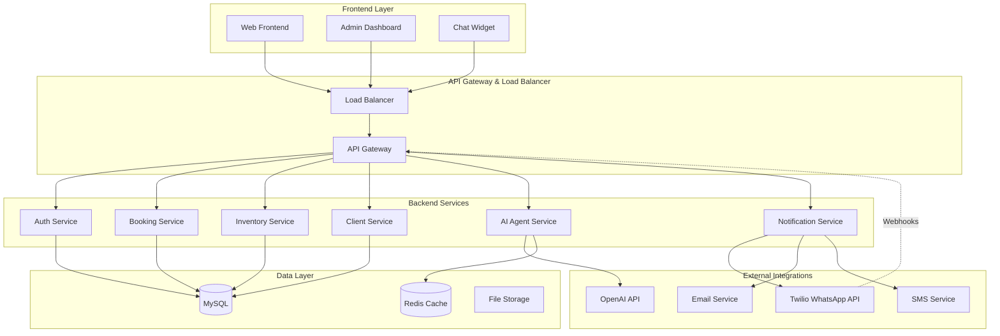
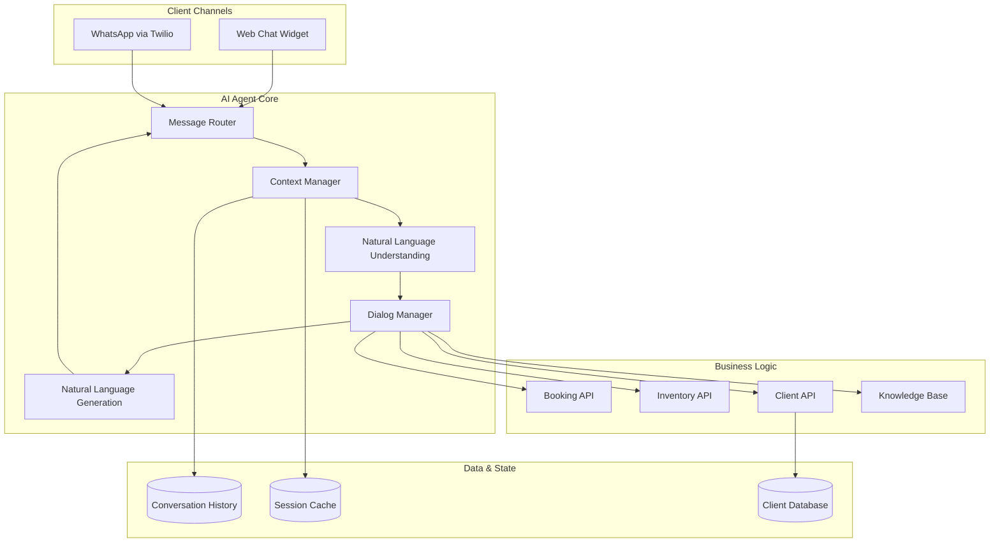

# Documento de Diseño - Sistema de Gestión para Clínica de Belleza

## Visión General

El sistema está diseñado como una arquitectura de microservicios con un backend API REST centralizado, múltiples frontends (dashboard administrativo y web público), y un agente de IA que opera de manera unificada en web y WhatsApp vía Twilio. La arquitectura prioriza la escalabilidad, seguridad y experiencia de usuario consistente across channels.

## Arquitectura

### Arquitectura General del Sistema



### Arquitectura del Agente IA Multicanal



## Componentes y Interfaces

### 1. Backend API Services

#### Auth Service
- **Responsabilidad:** Autenticación y autorización de usuarios
- **Endpoints principales:**
  - `POST /auth/login` - Login de administradores
  - `POST /auth/refresh` - Renovación de tokens
  - `GET /auth/verify` - Verificación de tokens
- **Tecnología:** JWT tokens, bcrypt para passwords
- **Base de datos:** Tabla `users`, `roles`, `permissions`

#### Client Service
- **Responsabilidad:** Gestión completa de clientes
- **Endpoints principales:**
  - `GET /clients` - Lista de clientes con filtros
  - `POST /clients` - Registro de nuevo cliente
  - `GET /clients/{id}` - Perfil completo del cliente
  - `PUT /clients/{id}` - Actualización de datos
  - `GET /clients/phone/{phone}` - Búsqueda por teléfono (para WhatsApp)
- **Modelos de datos:**
  ```typescript
  interface Client {
    id: string;
    phone: string; // Identificador único para WhatsApp
    name: string;
    email?: string;
    allergies: string[];
    preferences: string[];
    loyaltyPoints: number;
    createdAt: Date;
    updatedAt: Date;
  }
  ```

#### Booking Service
- **Responsabilidad:** Gestión de citas y agenda
- **Endpoints principales:**
  - `GET /bookings/availability` - Consulta disponibilidad
  - `POST /bookings` - Crear nueva cita
  - `PUT /bookings/{id}` - Modificar cita existente
  - `DELETE /bookings/{id}` - Cancelar cita
  - `GET /bookings/client/{clientId}` - Historial de citas
- **Modelos de datos:**
  ```typescript
  interface Booking {
    id: string;
    clientId: string;
    serviceId: string;
    professionalId: string;
    dateTime: Date;
    duration: number;
    status: 'confirmed' | 'cancelled' | 'completed';
    notes?: string;
    createdAt: Date;
  }
  ```

#### Inventory Service
- **Responsabilidad:** Gestión de productos y servicios
- **Endpoints principales:**
  - `GET /services` - Lista de servicios disponibles
  - `POST /services` - Crear nuevo servicio
  - `GET /products` - Inventario de productos
  - `PUT /products/{id}/stock` - Actualizar stock
- **Modelos de datos:**
  ```typescript
  interface Service {
    id: string;
    name: string;
    category: string;
    price: number;
    duration: number;
    description: string;
    images: string[];
    requirements: string[];
    isActive: boolean;
  }
  
  interface Product {
    id: string;
    name: string;
    category: string;
    price: number;
    stock: number;
    minStock: number;
    ingredients: string[];
    compatibleServices: string[];
  }
  ```

#### AI Agent Service
- **Responsabilidad:** Motor central del agente IA
- **Endpoints principales:**
  - `POST /ai/chat` - Procesar mensaje de chat
  - `POST /ai/whatsapp/webhook` - Webhook para Twilio
  - `GET /ai/conversations/{clientId}` - Historial de conversación
  - `POST /ai/escalate` - Escalar a agente humano
- **Componentes internos:**
  - **Message Router:** Enruta mensajes según canal y contexto
  - **Context Manager:** Mantiene estado de conversación
  - **Intent Recognition:** Identifica intención del usuario
  - **Dialog Manager:** Gestiona flujo de conversación
  - **Response Generator:** Genera respuestas naturales

#### Notification Service
- **Responsabilidad:** Envío de notificaciones multicanal
- **Endpoints principales:**
  - `POST /notifications/send` - Enviar notificación
  - `GET /notifications/templates` - Plantillas disponibles
  - `POST /notifications/schedule` - Programar envío
- **Canales soportados:** WhatsApp (Twilio), Email, SMS

### 2. Frontend Components

#### Admin Dashboard
- **Tecnología:** React + TypeScript + Material-UI
- **Módulos principales:**
  - Dashboard principal con métricas
  - Gestión de servicios y productos
  - Calendario de citas
  - Base de datos de clientes
  - Monitor de conversaciones IA
  - Configuración de Twilio
- **Características:**
  - Responsive design
  - Real-time updates via WebSocket
  - Exportación de reportes
  - Sistema de notificaciones

#### Web Frontend Público
- **Tecnología:** Next.js + TypeScript + Tailwind CSS
- **Páginas principales:**
  - Landing page con servicios destacados
  - Catálogo de servicios con filtros
  - Sistema de reservas online
  - Tienda de productos
  - Chat widget integrado
- **Características:**
  - SEO optimizado
  - Progressive Web App (PWA)
  - Integración con chat IA
  - Pasarela de pagos

#### Chat Widget
- **Tecnología:** React component embebible
- **Características:**
  - Interfaz consistente con WhatsApp
  - Soporte para multimedia
  - Persistencia de conversación
  - Transición fluida a WhatsApp

### 3. Integración Twilio WhatsApp

#### Webhook Configuration
```typescript
interface TwilioWebhookPayload {
  MessageSid: string;
  From: string; // Número de WhatsApp del cliente
  To: string;   // Número de la clínica
  Body: string; // Contenido del mensaje
  MediaUrl?: string; // URL de imagen/documento
  MediaContentType?: string;
}
```

#### Message Processing Flow
1. **Recepción:** Twilio envía webhook a `/ai/whatsapp/webhook`
2. **Validación:** Verificar signature de Twilio
3. **Identificación:** Buscar cliente por número de teléfono
4. **Contexto:** Recuperar historial de conversación
5. **Procesamiento:** Enviar a AI Agent Service
6. **Respuesta:** Generar respuesta apropiada
7. **Envío:** Usar Twilio API para enviar respuesta
8. **Logging:** Almacenar conversación en base de datos

#### WhatsApp Templates
```typescript
interface WhatsAppTemplate {
  name: string;
  language: 'es';
  components: {
    type: 'BODY';
    parameters: Array<{
      type: 'TEXT';
      text: string;
    }>;
  }[];
}

// Ejemplo: Recordatorio de cita
const appointmentReminder: WhatsAppTemplate = {
  name: 'appointment_reminder',
  language: 'es',
  components: [{
    type: 'BODY',
    parameters: [
      { type: 'TEXT', text: '{{client_name}}' },
      { type: 'TEXT', text: '{{service_name}}' },
      { type: 'TEXT', text: '{{appointment_date}}' },
      { type: 'TEXT', text: '{{appointment_time}}' }
    ]
  }]
};
```

## Modelos de Datos

### Base de Datos Principal (MySQL)

```sql
-- Clientes
CREATE TABLE clients (
    id CHAR(36) PRIMARY KEY DEFAULT (UUID()),
    phone VARCHAR(20) UNIQUE NOT NULL,
    name VARCHAR(255) NOT NULL,
    email VARCHAR(255),
    allergies JSON,
    preferences JSON,
    loyalty_points INTEGER DEFAULT 0,
    created_at TIMESTAMP DEFAULT CURRENT_TIMESTAMP,
    updated_at TIMESTAMP DEFAULT CURRENT_TIMESTAMP ON UPDATE CURRENT_TIMESTAMP,
    INDEX idx_phone (phone),
    INDEX idx_created_at (created_at)
);

-- Servicios
CREATE TABLE services (
    id CHAR(36) PRIMARY KEY DEFAULT (UUID()),
    name VARCHAR(255) NOT NULL,
    category VARCHAR(100) NOT NULL,
    price DECIMAL(10,2) NOT NULL,
    duration INTEGER NOT NULL, -- en minutos
    description TEXT,
    images JSON,
    requirements JSON,
    is_active BOOLEAN DEFAULT true,
    created_at TIMESTAMP DEFAULT CURRENT_TIMESTAMP,
    INDEX idx_category (category),
    INDEX idx_active (is_active)
);

-- Productos
CREATE TABLE products (
    id CHAR(36) PRIMARY KEY DEFAULT (UUID()),
    name VARCHAR(255) NOT NULL,
    category VARCHAR(100) NOT NULL,
    price DECIMAL(10,2) NOT NULL,
    stock INTEGER NOT NULL,
    min_stock INTEGER DEFAULT 5,
    ingredients JSON,
    compatible_services JSON,
    created_at TIMESTAMP DEFAULT CURRENT_TIMESTAMP,
    INDEX idx_category (category),
    INDEX idx_stock (stock)
);

-- Profesionales
CREATE TABLE professionals (
    id CHAR(36) PRIMARY KEY DEFAULT (UUID()),
    name VARCHAR(255) NOT NULL,
    specialties JSON,
    schedule JSON,
    is_active BOOLEAN DEFAULT true,
    created_at TIMESTAMP DEFAULT CURRENT_TIMESTAMP
);

-- Citas
CREATE TABLE bookings (
    id CHAR(36) PRIMARY KEY DEFAULT (UUID()),
    client_id CHAR(36) NOT NULL,
    service_id CHAR(36) NOT NULL,
    professional_id CHAR(36),
    date_time DATETIME NOT NULL,
    duration INTEGER NOT NULL,
    status ENUM('confirmed', 'cancelled', 'completed', 'no_show') DEFAULT 'confirmed',
    notes TEXT,
    created_at TIMESTAMP DEFAULT CURRENT_TIMESTAMP,
    FOREIGN KEY (client_id) REFERENCES clients(id) ON DELETE CASCADE,
    FOREIGN KEY (service_id) REFERENCES services(id) ON DELETE RESTRICT,
    FOREIGN KEY (professional_id) REFERENCES professionals(id) ON DELETE SET NULL,
    INDEX idx_client_date (client_id, date_time),
    INDEX idx_professional_date (professional_id, date_time),
    INDEX idx_status (status)
);

-- Conversaciones
CREATE TABLE conversations (
    id CHAR(36) PRIMARY KEY DEFAULT (UUID()),
    client_id CHAR(36) NOT NULL,
    channel ENUM('web', 'whatsapp') NOT NULL,
    status ENUM('active', 'closed', 'escalated') DEFAULT 'active',
    context JSON,
    last_activity TIMESTAMP DEFAULT CURRENT_TIMESTAMP,
    created_at TIMESTAMP DEFAULT CURRENT_TIMESTAMP,
    FOREIGN KEY (client_id) REFERENCES clients(id) ON DELETE CASCADE,
    INDEX idx_client_channel (client_id, channel),
    INDEX idx_last_activity (last_activity)
);

-- Mensajes individuales
CREATE TABLE messages (
    id CHAR(36) PRIMARY KEY DEFAULT (UUID()),
    conversation_id CHAR(36) NOT NULL,
    sender_type ENUM('client', 'ai', 'human') NOT NULL,
    content TEXT NOT NULL,
    media_url TEXT,
    metadata JSON,
    timestamp TIMESTAMP DEFAULT CURRENT_TIMESTAMP,
    FOREIGN KEY (conversation_id) REFERENCES conversations(id) ON DELETE CASCADE,
    INDEX idx_conversation_timestamp (conversation_id, timestamp)
);

-- Usuarios del sistema (administradores)
CREATE TABLE users (
    id CHAR(36) PRIMARY KEY DEFAULT (UUID()),
    username VARCHAR(100) UNIQUE NOT NULL,
    email VARCHAR(255) UNIQUE NOT NULL,
    password_hash VARCHAR(255) NOT NULL,
    role ENUM('admin', 'manager', 'staff') DEFAULT 'staff',
    is_active BOOLEAN DEFAULT true,
    last_login TIMESTAMP NULL,
    created_at TIMESTAMP DEFAULT CURRENT_TIMESTAMP,
    INDEX idx_username (username),
    INDEX idx_email (email)
);

-- Notificaciones programadas
CREATE TABLE scheduled_notifications (
    id CHAR(36) PRIMARY KEY DEFAULT (UUID()),
    client_id CHAR(36) NOT NULL,
    booking_id CHAR(36),
    type ENUM('appointment_reminder', 'follow_up', 'promotion') NOT NULL,
    channel ENUM('whatsapp', 'email', 'sms') NOT NULL,
    scheduled_for DATETIME NOT NULL,
    status ENUM('pending', 'sent', 'failed') DEFAULT 'pending',
    template_name VARCHAR(100),
    template_data JSON,
    created_at TIMESTAMP DEFAULT CURRENT_TIMESTAMP,
    FOREIGN KEY (client_id) REFERENCES clients(id) ON DELETE CASCADE,
    FOREIGN KEY (booking_id) REFERENCES bookings(id) ON DELETE CASCADE,
    INDEX idx_scheduled_for (scheduled_for),
    INDEX idx_status (status)
);
```

### Cache Layer (Redis)

```typescript
// Estructura de cache para sesiones de chat
interface ChatSession {
  clientId: string;
  channel: 'web' | 'whatsapp';
  context: {
    currentIntent?: string;
    pendingBooking?: Partial<Booking>;
    lastMessages: Message[];
  };
  lastActivity: Date;
}

// Keys de Redis
// chat:session:{clientId} -> ChatSession
// chat:context:{conversationId} -> ConversationContext
// availability:cache -> AvailabilityData (TTL: 5 min)
// products:stock -> ProductStock (TTL: 1 min)
```

## Manejo de Errores

### Estrategia de Error Handling

1. **API Errors:**
   ```typescript
   interface APIError {
     code: string;
     message: string;
     details?: any;
     timestamp: Date;
   }
   
   // Códigos de error estándar
   enum ErrorCodes {
     VALIDATION_ERROR = 'VALIDATION_ERROR',
     CLIENT_NOT_FOUND = 'CLIENT_NOT_FOUND',
     BOOKING_CONFLICT = 'BOOKING_CONFLICT',
     TWILIO_ERROR = 'TWILIO_ERROR',
     AI_SERVICE_ERROR = 'AI_SERVICE_ERROR'
   }
   ```

2. **Twilio Error Handling:**
   - Retry automático con backoff exponencial
   - Fallback a notificaciones por email si WhatsApp falla
   - Logging detallado de errores de Twilio
   - Rate limiting para evitar sobrecarga

3. **AI Agent Error Handling:**
   - Respuestas de fallback cuando AI no entiende
   - Escalación automática a humano en casos complejos
   - Timeout de conversaciones inactivas
   - Recuperación de contexto en caso de fallo

## Estrategia de Testing

### Testing Pyramid

1. **Unit Tests (70%):**
   - Lógica de negocio de cada service
   - Funciones de utilidad
   - Validaciones de datos
   - AI intent recognition

2. **Integration Tests (20%):**
   - APIs entre servicios
   - Integración con Twilio
   - Base de datos operations
   - Cache operations

3. **E2E Tests (10%):**
   - Flujos completos de reserva
   - Conversaciones de chat end-to-end
   - Flujos de WhatsApp con Twilio sandbox
   - Dashboard workflows

### Test Data Management
- Fixtures para datos de prueba
- Mocking de APIs externas (Twilio, OpenAI)
- Database seeding para tests
- Cleanup automático post-test

## Consideraciones de Seguridad

### Autenticación y Autorización
- JWT tokens con refresh mechanism
- Role-based access control (RBAC)
- API rate limiting
- CORS configuration

### Protección de Datos
- Encriptación AES-256 para datos sensibles
- Hashing de passwords con bcrypt
- Sanitización de inputs
- SQL injection prevention

### Twilio Security
- Webhook signature validation
- Request origin validation
- Message content filtering
- Rate limiting por número de teléfono

### GDPR/LOPD Compliance
- Consentimiento explícito para WhatsApp
- Right to be forgotten implementation
- Data retention policies
- Audit logging

## Performance y Escalabilidad

### Optimizaciones de Performance
- Database indexing estratégico
- Query optimization
- Redis caching layer
- CDN para assets estáticos
- Image optimization y lazy loading

### Escalabilidad Horizontal
- Stateless services design
- Load balancer configuration
- Database connection pooling
- Microservices architecture

### Monitoring y Observabilidad
- Application Performance Monitoring (APM)
- Error tracking y alerting
- Business metrics dashboard
- Twilio usage monitoring
- AI conversation analytics

Esta arquitectura proporciona una base sólida para el sistema integral de gestión de clínica de belleza, con especial énfasis en la integración robusta con Twilio WhatsApp y la experiencia unificada del agente IA across channels.