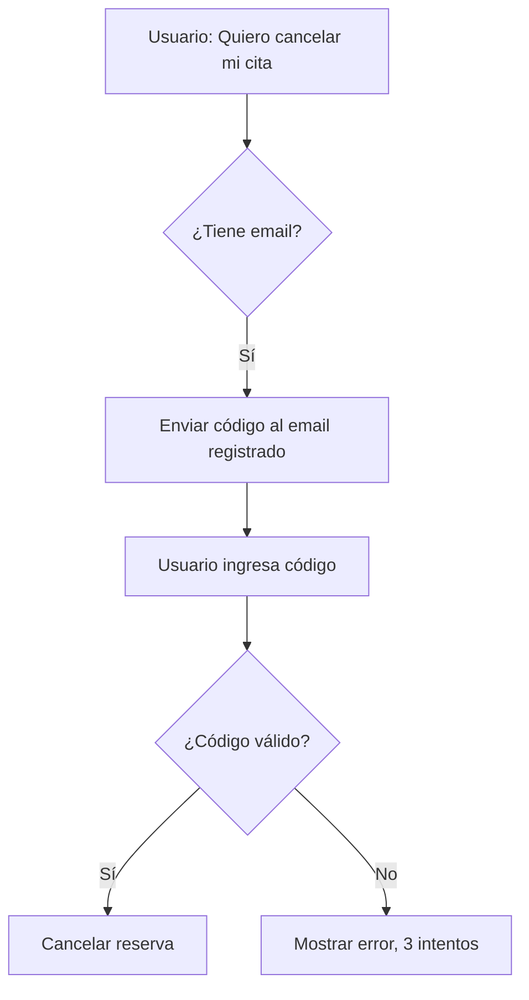
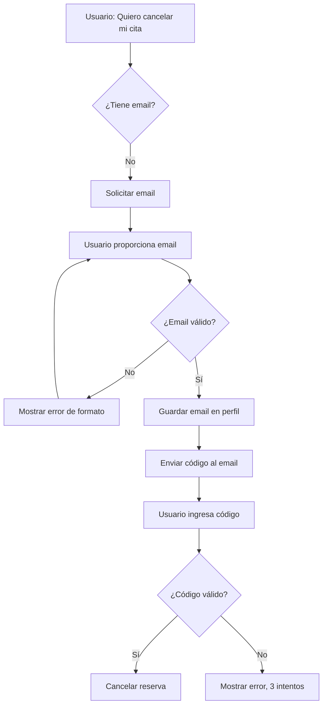

# 🔒 Flujo de Autenticación por Email Mejorado

## 📋 Resumen de Cambios

Se ha mejorado el sistema de autenticación del chatbot para que cuando un usuario intente realizar acciones sensibles (cancelar/reagendar reservas) y NO tenga email registrado, el sistema:

1. **Solicita el email** al usuario
2. **Guarda el email** en el perfil del cliente
3. **Envía código de verificación** al email proporcionado
4. **Valida el código** ingresado por el usuario
5. **Procede con la acción** solicitada

---

## 🎯 Problema Resuelto

**ANTES:**
```
Usuario: "Quiero cancelar mi cita"
Bot: "⚠️ No tengo un email registrado para ti. 
      Por favor, contacta directamente a la clínica."
```
❌ Usuario frustrado, debe llamar a la clínica

**AHORA:**
```
Usuario: "Quiero cancelar mi cita"
Bot: "📧 Para verificar tu identidad, ¿cuál es tu correo electrónico?"
Usuario: "juan@example.com"
Bot: "✅ Email guardado. Te he enviado un código de verificación..."
Usuario: "123456"
Bot: "✅ Identidad verificada. Procediendo a cancelar tu reserva..."
```
✅ Usuario puede completar la acción inmediatamente

---

## 🔄 Flujo Completo

### **Escenario 1: Usuario CON email registrado**



**Conversación:**
```
Usuario: "Quiero cancelar mi cita"
Bot: "🔒 Verificación de Seguridad
     
     Te he enviado un código de verificación al email ju***@example.com
     
     Por favor, responde con el código de 6 dígitos que recibiste.
     
     ⏰ El código expira en 10 minutos."

Usuario: "123456"
Bot: "✅ Identidad verificada correctamente
     
     Ahora puedes continuar con tu solicitud. ¿Qué te gustaría hacer?"

[Sistema procede a cancelar la reserva]
```

---

### **Escenario 2: Usuario SIN email registrado (NUEVO)**



**Conversación:**
```
Usuario: "Quiero cancelar mi cita"
Bot: "📧 Verificación de Seguridad
     
     Para continuar, necesito verificar tu identidad.
     
     ¿Cuál es tu correo electrónico?"

Usuario: "juan@example.com"
Bot: "✅ Email guardado correctamente
     
     📧 Email registrado: ju***@example.com
     
     🔒 Verificación de Seguridad
     
     Te he enviado un código de verificación de 6 dígitos a tu email.
     
     Por favor, revisa tu bandeja de entrada (y carpeta de spam) 
     y responde con el código que recibiste.
     
     ⏰ El código expira en 10 minutos."

Usuario: "123456"
Bot: "✅ Identidad verificada correctamente
     
     Ahora puedes continuar con tu solicitud. ¿Qué te gustaría hacer?"

[Sistema procede a cancelar la reserva]
```

---

### **Escenario 3: Email con formato inválido**

```
Usuario: "Quiero cancelar mi cita"
Bot: "📧 Para verificar tu identidad, ¿cuál es tu correo electrónico?"

Usuario: "juan.example.com"  [❌ Sin @]
Bot: "❌ El formato del email no es válido. 
     Por favor, ingresa un email válido (ejemplo: tu@email.com)"

Usuario: "juan@example.com"  [✅ Formato correcto]
Bot: "✅ Email guardado correctamente..."
```

---

## 🔧 Cambios Técnicos Implementados

### **1. ChatAuthService.ts**

#### **Método modificado: `requestEmailVerification()`**
```typescript
// ANTES:
if (!hasEmail) {
  return {
    message: '⚠️ Contacta directamente a la clínica',
    requiresVerification: true
  };
}

// AHORA:
if (!hasEmail) {
  await ContextManager.setVariable(conversationId, 'awaitingEmailInput', true);
  await ContextManager.setVariable(conversationId, 'pendingAction', action);
  
  return {
    message: '📧 ¿Cuál es tu correo electrónico?',
    requiresVerification: true,
    verificationMethod: 'email'
  };
}
```

#### **Nuevo método: `isAwaitingEmailInput()`**
```typescript
static async isAwaitingEmailInput(conversationId: string): Promise<boolean> {
  const awaiting = await ContextManager.getVariable(conversationId, 'awaitingEmailInput');
  return awaiting === true;
}
```

#### **Nuevo método: `captureAndSaveEmail()`**
```typescript
static async captureAndSaveEmail(
  conversationId: string,
  clientId: string,
  emailInput: string
): Promise<{ success: boolean; message: string; emailSaved?: boolean }> {
  // 1. Validar formato de email
  // 2. Guardar email en el perfil del cliente
  // 3. Generar código de verificación
  // 4. Enviar código por email
  // 5. Retornar mensaje de confirmación
}
```

#### **Nuevo método: `isEmailMessage()`**
```typescript
static isEmailMessage(message: string): boolean {
  const emailRegex = /^[^\s@]+@[^\s@]+\.[^\s@]+$/;
  return emailRegex.test(message.trim());
}
```

---

### **2. MessageRouter.ts**

#### **Nueva verificación antes de procesar mensaje:**
```typescript
// Verificar si está esperando que proporcione su email
const awaitingEmailInput = await ChatAuthService.isAwaitingEmailInput(conversation.id);

if (awaitingEmailInput) {
  const captureResult = await ChatAuthService.captureAndSaveEmail(
    conversation.id,
    client.id,
    request.content
  );

  // Guardar respuesta y retornar
  const aiMessage = await ConversationModel.addMessage(conversation.id, {
    senderType: 'ai',
    content: captureResult.message,
    metadata: {
      emailCapture: true,
      emailSaved: captureResult.emailSaved
    }
  });

  return {
    response: {
      message: captureResult.message,
      intent: 'email_capture',
      entities: [],
      needsHumanEscalation: false
    },
    conversationId: conversation.id,
    messageId: aiMessage.id,
    processingTime
  };
}
```

---

## 🔐 Seguridad

### **Validaciones implementadas:**

1. ✅ **Formato de email:** Regex `/^[^\s@]+@[^\s@]+\.[^\s@]+$/`
2. ✅ **Código de 6 dígitos:** Generado aleatoriamente
3. ✅ **Expiración:** 10 minutos
4. ✅ **Intentos limitados:** Máximo 3 intentos
5. ✅ **Email enmascarado:** `ju***@example.com` en mensajes
6. ✅ **Persistencia:** Email guardado en BD del cliente

### **Niveles de seguridad:**

- **Nivel 0:** Sin verificación (consultas públicas)
- **Nivel 1:** Verificación ligera por teléfono (ver reservas)
- **Nivel 2:** Verificación fuerte por email + código (cancelar/reagendar)

---

## 📧 Email de Verificación

El usuario recibe un email con:

- ✅ Logo de la clínica
- ✅ Código de 6 dígitos destacado
- ✅ Instrucciones claras
- ✅ Advertencias de seguridad:
  - Expira en 10 minutos
  - Solo 3 intentos
  - No compartir el código

---

## 🧪 Casos de Prueba

### **Test 1: Usuario sin email intenta cancelar**
```
✅ Bot solicita email
✅ Usuario proporciona email válido
✅ Email se guarda en BD
✅ Código se envía por email
✅ Usuario ingresa código correcto
✅ Reserva se cancela exitosamente
```

### **Test 2: Email con formato inválido**
```
✅ Bot solicita email
❌ Usuario proporciona "juan.example" (sin @)
✅ Bot muestra error de formato
✅ Usuario proporciona email válido
✅ Flujo continúa normalmente
```

### **Test 3: Código incorrecto**
```
✅ Bot envía código
❌ Usuario ingresa código incorrecto
✅ Bot muestra "Te quedan 2 intentos"
❌ Usuario ingresa código incorrecto nuevamente
✅ Bot muestra "Te queda 1 intento"
✅ Usuario ingresa código correcto
✅ Verificación exitosa
```

### **Test 4: Código expirado**
```
✅ Bot envía código
⏰ Pasan 11 minutos
❌ Usuario ingresa código (aunque sea correcto)
✅ Bot muestra "El código ha expirado"
✅ Usuario debe solicitar nuevo código
```

---

## 🚀 Cómo Probar

### **1. Reiniciar el backend:**
```bash
docker-compose restart backend
```

### **2. Probar desde WhatsApp:**
```
1. Envía: "Quiero cancelar mi cita"
2. Bot responde: "¿Cuál es tu correo electrónico?"
3. Envía: "tu@email.com"
4. Bot responde: "Email guardado. Te he enviado un código..."
5. Revisa tu email y copia el código
6. Envía el código: "123456"
7. Bot responde: "Identidad verificada"
8. Bot procede a cancelar la reserva
```

### **3. Verificar en la base de datos:**
```sql
-- Ver que el email se guardó
SELECT id, name, email, phone FROM clients WHERE phone = '+56912345678';
```

---

## 📊 Métricas de Éxito

- ✅ **Tasa de captura de emails:** % de usuarios que proporcionan email
- ✅ **Tasa de verificación exitosa:** % de códigos validados correctamente
- ✅ **Tiempo promedio del flujo:** Desde solicitud hasta acción completada
- ✅ **Tasa de abandono:** % de usuarios que no completan el flujo

---

## 🎯 Beneficios

1. **Para el usuario:**
   - ✅ No necesita llamar a la clínica
   - ✅ Gestión inmediata de reservas
   - ✅ Experiencia fluida y conversacional

2. **Para la clínica:**
   - ✅ Captura de emails de clientes
   - ✅ Base de datos más completa
   - ✅ Menos llamadas de cancelación
   - ✅ Mejor seguridad en gestión de reservas

3. **Para el sistema:**
   - ✅ Autenticación robusta
   - ✅ Trazabilidad de acciones
   - ✅ Prevención de cancelaciones no autorizadas

---

## 🔄 Próximas Mejoras (Opcional)

1. **Recordar email en futuras conversaciones**
   - Si el usuario ya proporcionó email, no volver a pedirlo

2. **Opción de verificación por SMS**
   - Alternativa para usuarios sin email

3. **Verificación en dos pasos**
   - Email + SMS para acciones críticas

4. **Dashboard de métricas**
   - Visualizar tasa de captura de emails
   - Analizar abandono del flujo

---

**Fecha de implementación:** 2025-01-26
**Versión:** 1.0
**Estado:** ✅ Implementado y listo para pruebas
